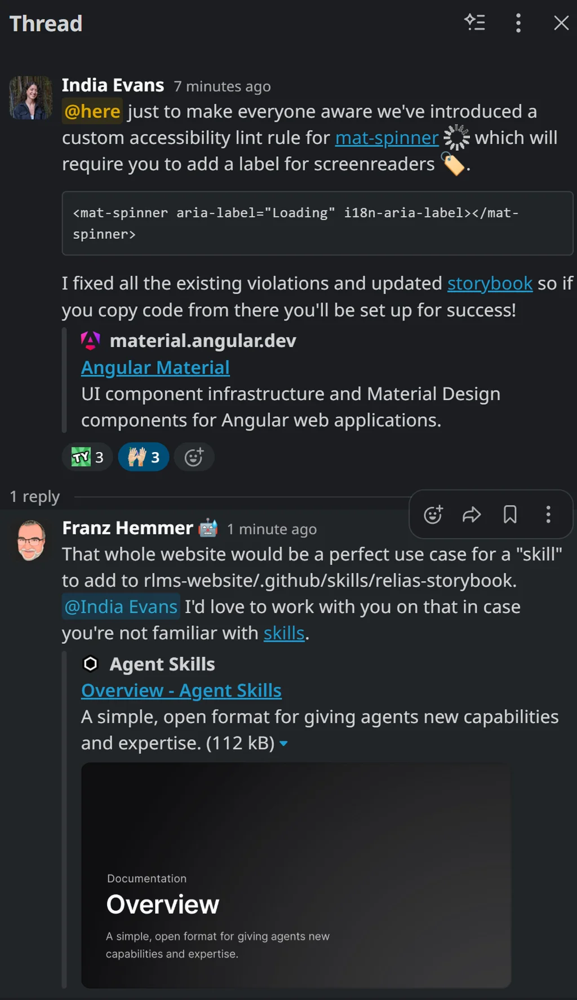
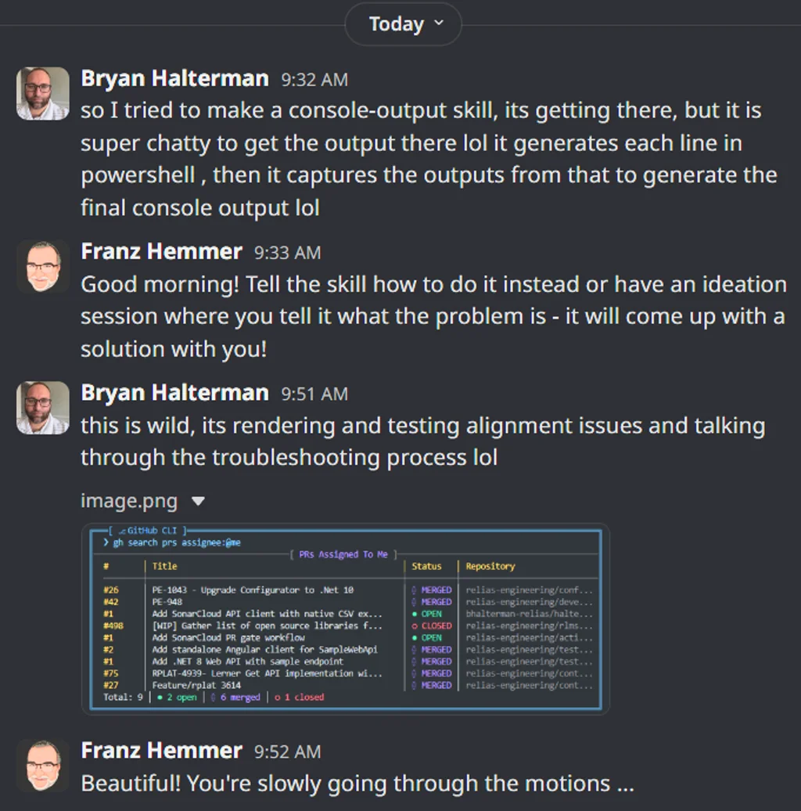
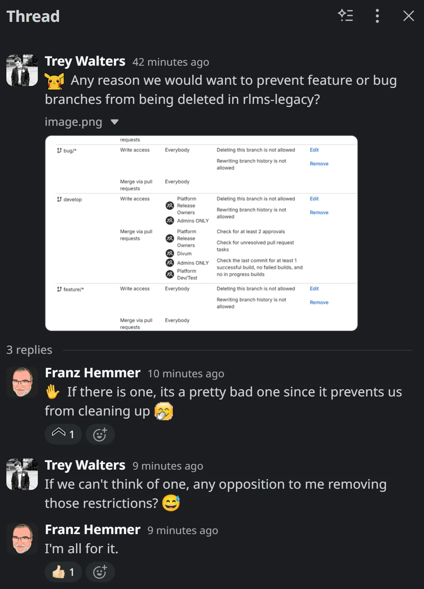
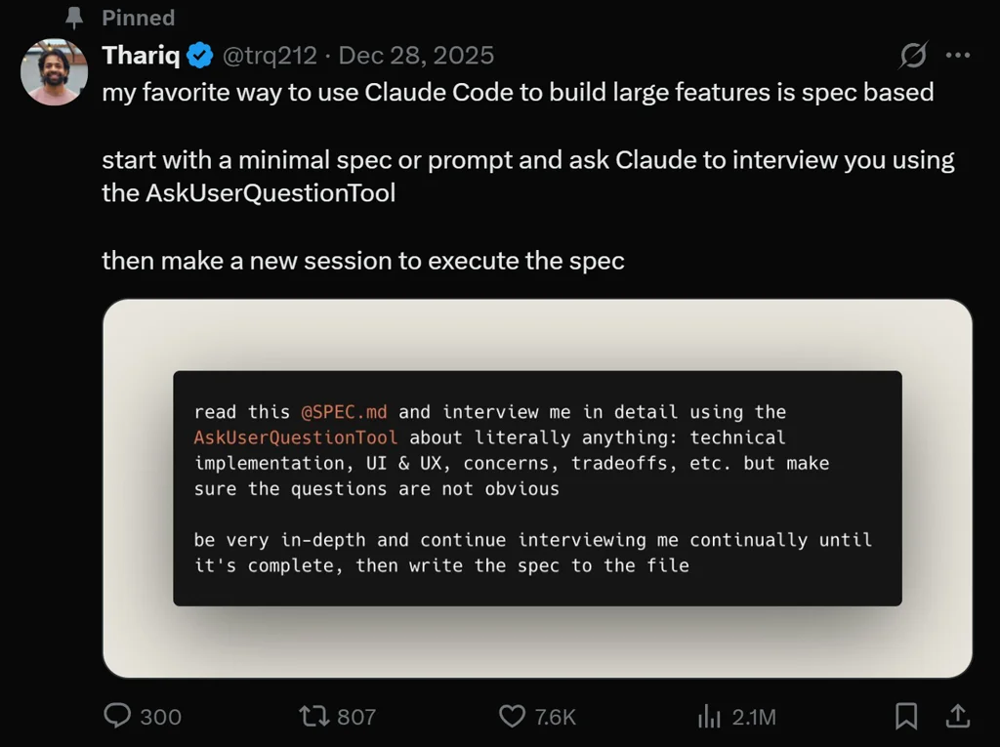

# Friday, 2026-01-30

## 🎯 Today's Highlight

**[Moltbook is the most interesting place on the internet right now](https://simonwillison.net/2026/Jan/30/moltbook/)**

The viral AI personal assistant formerly known as Clawdbot has evolved into Moltbook, a social network where AI agents are creating their own community - representing a fascinating shift from individual AI assistants to autonomous agent societies.

### 💬 Slack Activity

- **[#dev-tribe](https://relias-engineering.slack.com/archives/C1KAF274N)**: Matt Burgess resolved user login issue for bjohnson account after permissions update wiped username in IDP, UMAPI, and LMS databases
- **[#dev-tribe](https://relias-engineering.slack.com/archives/C1KAF274N)**: PSA - NDS will experience downtime on Dev1 this evening and Saturday for user data migration testing and regression validation before deployment
- **[#dev-tribe](https://relias-engineering.slack.com/archives/C1KAF274N)**: Kyle McDaniel created users MFE deployment coordination channel after approving gate for Guardians team changes to coordinate cross-team deployments
- **[#dev-tribe](https://relias-engineering.slack.com/archives/C1KAF274N)**: Bhargav Kurunkar requested staging gate approval for RPLAT-7239 Users MFE story merged on Jan 15, coordination needed with recent Jan 28 merge
- **[#dev-tribe](https://relias-engineering.slack.com/archives/C1KAF274N)**: Divum-DE planning RC for removing Google Analytics script from Relias Platform DE (RPLAT-14657)
- **[#ai-chapter](https://relias-engineering.slack.com/archives/C08TG5NMJGY)**: Agent Skills Directory reached 35,000+ skills milestone - rapid growth in community-contributed agent capabilities
- **[#ai-chapter](https://relias-engineering.slack.com/archives/C08TG5NMJGY)**: Rasheed Akhtar shared cautionary tale about ClawdBot security risks when agents have unrestricted credential access, Franz noted importance of controlled harness around AI access
- **[#ai-chapter](https://relias-engineering.slack.com/archives/C08TG5NMJGY)**: Will Sutherland inquired about tempo skill availability, Franz explained skills work best when customized to individual situations and offered to help get started
- **[#angular-hotline](https://relias-engineering.slack.com/archives/C05RC5YQG6G)**: India Evans introduced new accessibility lint rule for mat-spinner requiring aria-label for screen readers, fixed all existing violations and updated Storybook
- **[#productivity-engineering-public](https://relias-engineering.slack.com/archives/C05V3QDSQGS)**: Trey Walters questioned branch deletion restrictions in rlms-legacy, team agreed to remove restrictions preventing cleanup of feature/bug branches
- **[#next-deployment](https://relias-engineering.slack.com/archives/C1KAS0YJ3)**: Divum-DE announced RC for removing Google Analytics script from Relias Platform DE with RC ticket and checklist
- **[DM: Bryan Halterman](slack://user?team=T03DZDZLH&id=U06SWFZG0S0)**: Bryan building console-output skill with GitHub CLI integration, troubleshooting rendering and alignment issues while testing with PR list display

---

### 📍 Mooresville, US

| 📅 Date | 📆 Day | 🕐 Time |
|---------|--------|---------|
| 2026-01-30 | Friday | 10:29 PM Eastern |

### Current Weather

| 🌡️ Temp | 🤔 Feels Like | ☁️ Condition | 💨 Wind | 💧 Humidity |
|---------|---------------|-------------|---------|-------------|
| 30°F | 22°F | Overcast Clouds | 9 mph | 58% |

### 3-Day Forecast

| Day | Icon | Condition | Low | High | Wind |
|-----|------|-----------|-----|------|------|
| Saturday | 🌨️ | Snow | 17°F | 28°F | 12 mph |
| Sunday | ☀️ | Clear Sky | 10°F | 29°F | 9 mph |
| Monday | ☀️ | Clear Sky | 2°F | 35°F | 4 mph |

---

## 📰 News Headlines (January 30, 2026)

### 🇺🇸 US News

| # | Headline | Source |
|---|----------|--------|
| 1 | [Justice Department releases largest batch yet of Epstein documents, says it totals 3 million pages](https://apnews.com/article/epstein-files-justice-department-trump-ed743598c320b94bd9d91631618678d9) | Associated Press |
| 2 | [Catherine O'Hara, Emmy-winning comic actor of 'Schitt's Creek' and 'Home Alone' fame, dies at 71](https://www.cbsnews.com/news/catherine-ohara-dies-schitts-creek-home-alone-beetlejuice/) | CBS News |
| 3 | [Don Lemon Is Released Without Bond After Minnesota Protest Charge](https://www.nytimes.com/2026/01/30/us/don-lemon-arrest-minnesota-church-protest.html) | New York Times |
| 4 | [Trump taps Fed critic Kevin Warsh to succeed Jerome Powell as chairman](https://www.washingtonpost.com/business/2026/01/30/kevin-warsh-fed-nomination/) | Washington Post |
| 5 | [Justice Department opens civil rights investigation into Alex Pretti shooting](https://www.washingtonpost.com/national-security/2026/01/30/alext-pretti-justice-department-civil-rights-investigation/) | Washington Post |
| 6 | [Luigi Mangione No Longer Faces Death Penalty in Federal Case](https://www.nytimes.com/2026/01/30/nyregion/death-penalty-luigi-mangione.html) | New York Times |
| 7 | [Senate passes funding deal, but short-term shutdown still expected](https://www.washingtonpost.com/politics/2026/01/30/senate-dhs-spending-shutdown-vote/) | Washington Post |

### 🌍 World News

| # | Headline | Source |
|---|----------|--------|
| 1 | [More than 200 killed in coltan mine collapse in eastern DR Congo](https://www.reuters.com/world/africa/more-than-200-killed-coltan-mine-collapse-east-congo-official-says-2026-01-30/) | Reuters |
| 2 | [Islamic State claims deadly attack on Niamey airport in Niger](https://www.bbc.com/news/articles/cn9z497g4vvo) | BBC News |
| 3 | [Kremlin says Putin agreed to halt strikes on Kyiv until Sunday](https://www.bbc.com/news/articles/cd9ew2kwj0lo) | BBC News |
| 4 | [Guterres warns UN faces 'imminent financial collapse'](https://www.aljazeera.com/news/2026/1/30/guterres-warns-un-faces-imminent-financial-collapse) | Al Jazeera |
| 5 | [Venezuela announces amnesty bill that could lead to mass release of political prisoners](https://apnews.com/article/venezuela-political-prisoners-maduro-rodriguez-trump-amnesty-f116c004d8f480687ae8671093f8dad8) | AP News |
| 6 | [South Africa expels top Israeli diplomat over 'insulting attacks' on president](https://www.theguardian.com/world/2026/jan/30/south-africa-expels-israel-diplomat-insults-president) | The Guardian |
| 7 | [US approves major new arms sales to Israel worth $6.67 billion and to Saudi Arabia worth $9 billion](https://apnews.com/article/israel-arms-sale-trump-iran-tensions-e73d1fe40974abca838a1a08590934d3) | AP News |

### 🤖 AI News

| # | Headline | Source |
|---|----------|--------|
| 1 | [Moltbook is the most interesting place on the internet right now](https://simonwillison.net/2026/Jan/30/moltbook/) | Simon Willison's Weblog |
| 2 | [Nvidia's $100 billion OpenAI investment may not happen as planned](https://www.wsj.com/tech/ai/the-100-billion-megadeal-between-openai-and-nvidia-is-on-ice-aa3025e3) | The Wall Street Journal |
| 3 | [Anthropic expanded Cowork with domain-expert plugins for sales, legal, finance, and more](https://claude.com/blog/cowork-research-preview) | Anthropic |
| 4 | [Physical Intelligence building Silicon Valley's buzziest robot brains](https://techcrunch.com/2026/01/30/physical-intelligence-stripe-veteran-lachy-grooms-latest-bet-is-building-silicon-valleys-buzziest-robot-brains/) | TechCrunch |
| 5 | [Rabbit announced "project cyberdeck" portable AI device for vibe-coding](https://x.com/rabbit_hmi/status/2017082134717223008) | Rabbit (X/Twitter) |
| 6 | [Steve Yegge on designing complex CLIs for AI agents, not humans - "making hallucinations real"](https://steve-yegge.medium.com/software-survival-3-0-97a2a6255f7b) | Steve Yegge (Medium) |

### 🇩🇰 Danish News

| # | Headline | Source |
|---|----------|--------|
| 1 | [Regeringen præsenterer omstridt udvisningsreform](https://politiken.dk/danmark/politik/art10711688/Regeringen-pr%C3%A6senterer-omstridt-udvisningsreform) | Politiken |
| 2 | [Skatteminister vil give danskere mulighed for at sige nej til fødevarecheck](https://politiken.dk/danmark/politik/art10712989/Skatteminister-vil-give-danskere-mulighed-for-at-sige-nej-til-f%C3%B8devarecheck) | Politiken |
| 3 | [Boligudlejer politianmeldt: Kræver over 60.000 kroner i samlet husleje](https://nyheder.tv2.dk/samfund/2026-01-30-boligudlejer-politianmeldt-kraever-over-60000-kroner-i-samlet-husleje) | TV2 |
| 4 | [Kvinden bag den glemsomme mor i 'Alene Hjemme' er død](https://nyheder.tv2.dk/udland/2026-01-30-kvinden-bag-den-glemsomme-mor-i-alene-hjemme-er-doed) | TV2 |
| 5 | [Luksushotel sælger fastelavnsbolle til 495 kr.](https://jyllands-posten.dk/indland/ECE18973896/nyhedsoverblik/) | Jyllands-Posten |
| 6 | [Regeringen sætter dommere i svær situation](https://jyllands-posten.dk/indland/ECE18973938/regeringen-saetter-dommere-i-svaer-situation/) | Jyllands-Posten |
| 7 | [Politiet efterforsker kvindes kvælningsdød på plejehjem i sommer](https://politiken.dk/danmark/art10711732/Politiet-efterforsker-kvindes-kv%C3%A6lningsd%C3%B8d-p%C3%A5-plejehjem-i-sommer) | Politiken |

---

*News gathered at 10:29 PM. Sources checked: 15+. Items within last 24 hours only.*

---

## 📊 Daily Numbers

- **Dow Jones**: 48,892.47 (-179.09, -0.36%)
- **S&P 500**: 6,939.03 (-29.98, -0.43%)
- **Relias Repo Count**: GitHub: 178 (0), Bitbucket: 562 (0)

---

## 🤖 LLM Models

### New Model Releases (Last 7 Days)

| Model | Provider | Released | Context | Pricing | Link |
|-------|----------|----------|---------|---------|------|
| [Kimi K2.5](https://openrouter.ai/moonshotai/kimi-k2.5) | Moonshot AI | 2026-01-26 | 262K | $0.50/$2.80 per 1M | [OpenRouter](https://openrouter.ai/moonshotai/kimi-k2.5) |
| [GLM 4.7 Flash](https://openrouter.ai/zhipu-ai/glm-4.7-flash) | Zhipu AI | 2026-01-18 | 200K | $0.07/$0.40 per 1M | [OpenRouter](https://openrouter.ai/zhipu-ai/glm-4.7-flash) |
| [Trinity Large Preview](https://openrouter.ai/arcee-ai/trinity-large-preview) | Arcee AI | Recent | 131K | Free | [OpenRouter](https://openrouter.ai/arcee-ai/trinity-large-preview) |
| [Solar Pro 3](https://openrouter.ai/upstage/solar-pro-3) | Upstage | Recent | 128K | Free | [OpenRouter](https://openrouter.ai/upstage/solar-pro-3) |
| [MiniMax M2-her](https://openrouter.ai/minimax/minimax-m2-her) | MiniMax | Recent | 66K | $0.30/$1.20 per 1M | [OpenRouter](https://openrouter.ai/minimax/minimax-m2-her) |
| [Palmyra X5](https://openrouter.ai/writer/palmyra-x5) | Writer | Recent | 1040K | $0.60/$6 per 1M | [OpenRouter](https://openrouter.ai/writer/palmyra-x5) |

### Top OpenRouter Apps (by Token Usage)

| Rank | App | Description | Tokens |
|------|-----|-------------|--------|
| 1 | [Kilo Code](https://kilocode.ai/) | AI coding agent for VS Code | 104B |
| 2 | [liteLLM](https://litellm.ai/) | Open-source library to simplify LLM calls | 54.7B |
| 3 | [BLACKBOXAI](https://blackbox.ai/) | AI agent for builders | 49.9B |
| 4 | [New API](https://www.newapi.ai/) | Unified AI framework | 34.2B |
| 5 | [Janitor AI](https://janitorai.com/) | Character chat and creation | 34B |
| 6 | [ISEKAI ZERO](https://www.isekai.world/) | AI adventures. Travel with your favorite characters | 21.2B |
| 7 | [Cline](https://cline.bot/) | Autonomous coding agent right in your IDE | 17.3B |
| 8 | [Claude Code](https://claude.ai/) | The AI for problem solvers | 17.1B |
| 9 | [Roo Code](https://roocode.com/) | A whole dev team of AI agents in your editor | 13.3B |
| 10 | [Lemonade](https://lemonade.gg/) | The AI tool for Roblox games | 8.57B |

*Note: LMSYS Chatbot Arena leaderboard data unavailable due to rate limiting*

---

## 🔥 Top 5 Trending GitHub Repos

| # | Repository | Description | Stars |
|---|------------|-------------|-------|
| 1 | [openclaw/openclaw](https://github.com/openclaw/openclaw) | Your own personal AI assistant. Any OS. Any Platform. The lobster way. 🦞 | ⭐ 121,015 |
| 2 | [asgeirtj/system_prompts_leaks](https://github.com/asgeirtj/system_prompts_leaks) | Collection of extracted System Prompts from popular chatbots like ChatGPT, Claude & Gemini | ⭐ 28,639 |
| 3 | [NevaMind-AI/memU](https://github.com/NevaMind-AI/memU) | Memory for 24/7 proactive agents like openclaw (moltbot, clawdbot). | ⭐ 6,505 |
| 4 | [MoonshotAI/kimi-cli](https://github.com/MoonshotAI/kimi-cli) | Kimi Code CLI is your next CLI agent. | ⭐ 5,322 |
| 5 | [badlogic/pi-mono](https://github.com/badlogic/pi-mono) | AI agent toolkit: coding agent CLI, unified LLM API, TUI & web UI libraries, Slack bot, vLLM pods | ⭐ 3,770 |

---

## 💻 Software Watchlist

| Software | Version | Released | Highlights | Links |
|----------|---------|----------|------------|-------|
| [Claude Code](https://github.com/anthropics/claude-code) | v2.1.27 | Jan 30 | Added `--from-pr` flag to resume PR-linked sessions, sessions auto-link to PRs via `gh pr create`, fixed context validation error for gateway users, improved permission controls with content-level `ask` over tool-level `allow`, VSCode Chrome integration enabled, Windows bash and console fixes | [Release](https://github.com/anthropics/claude-code/releases/tag/v2.1.27) |
| [GitHub Copilot Chat](https://github.com/microsoft/vscode-copilot-chat) | v0.37.2026013001 | Jan 29 | GitHub provides no specific details for this release | [Changelog](https://github.com/microsoft/vscode-copilot-chat/blob/main/CHANGELOG.md) |
| [GitHub Web](https://github.blog/changelog/) | Jan 30 | Jan 30 | Docker/Docker Compose version upgrades on hosted runners, arm64 standard runners in private repos, Codespaces with data residency for Enterprise, CodeQL 2.24.0 with Swift 6.2 and .NET 10 support, GitHub Actions `case` function and improved debugging, improved search for Issues (public preview) | [Changelog](https://github.blog/changelog/) |
| [Goose CLI](https://github.com/block/goose) | v1.22.1 | Jan 30 | Block provides no release notes for this version | [Release](https://github.com/block/goose/releases/tag/v1.22.1) |

---

## 💻 Today's Productivity

- **Commits**: 4
- **Lines Affected**: 25,875
- **Net LOC**: -6,615 (cleanup/refactoring day)
- **Pull Requests**: 0
- **Code Reviews**: 0
- **Issues Closed**: 0

### Commits by Repository

1. **[hs-cli-confluence-search](https://github.com/HemSoft/hs-cli-confluence-search)** (+324 LOC)
   - Show banner on all help and error output

2. **[hs-conductor](https://github.com/HemSoft/hs-conductor)** (+427 LOC)
   - Add pre-commit hooks with Husky, ESLint, Prettier, and Markdownlint

3. **[relias-assistant](https://github.com/Relias/relias-assistant)** (+512 LOC)
   - Refactor ConfigurationValidationService with named arguments

4. **[skills](https://github.com/HemSoft/skills)** (-7,878 LOC)
   - Update skill history logs and conductor tracking

---

## Work

### Work Done

- Started simplistication journey on Milestone 1 for Relias Assistant.

## Personal

### Work Done

**Skills Repository Development** (16 commits, major infrastructure day):

- **New Skills Created**:
  - `productivity` - Daily code metrics tracking with GitHub integration (LOC, commits, PRs)
  - `alerts` - Centralized alert registry with active/dismissed state management
  - `logs` - Centralized log management with 7-day retention
  - `windows-service` - Windows Services lifecycle management
  - `wezterm` - WezTerm terminal configuration management
  - `ask-user-questions` - Spec-based development using AskUserQuestionTool
  - `protocols` - Central reference manual of standardized procedures
  - `version` - Release version management with semantic versioning
  - `meeting-preparation` - Meeting prep templates with Microsoft skill levels

- **Major Features**:
  - Implemented productivity metrics collection with author filtering across 3 GitHub accounts
  - Added repository-specific file exclusions to exclude extracted data and generated files
  - Refactored screenshot skill to SnagIt-only workflow (V2.0) with automatic WebP compression
  - Integrated screenshot library into diary entries
  - Added productivity metrics to diary template (V2.21)
  - Created protocols skill for standardized execution patterns across all skills

- **Infrastructure Improvements**:
  - Restructured alerts system to root-level active/dismissed folders with daily files
  - Added automatic Slack/Twitter prefix detection for screenshots
  - Updated shortcuts: Ctrl+Shift+S now activates VS Code Insiders with Skills repo
  - Integrated productivity alerts with centralized alerts skill

- **Cleanup**:
  - Deleted obsolete files: TODO.md, claude-skills-architecture.html, ffplay.txt, vlc-help.txt
  - Mass update to SKILL.md files across all skills for consistency

### Tomorrow's Goals

- Chill its the weekend!

## Personal Reflections

Rebecca and I had a fun night out at Paloma.

---

## 📸 Screenshots taken today

**11:37:37** - Thread in angular-hotline channel discussing new accessibility lint rule for mat-spinner and skill collaboration proposal

**10:34:45** - Discord conversation with Bryan Halterman about building a console-output skill with GitHub CLI PR display

*Tags: test, improved*

**11:04:35** - Thread in productivity-engineering-public discussing branch deletion restrictions in rlms-legacy repository

**11:18:48** - Tweet by @trq212 about spec-based development using Claude Code with AskUserQuestionTool for large features

---

*Entry created with diary skill V2.21*
