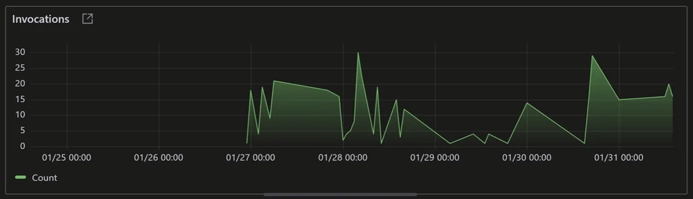
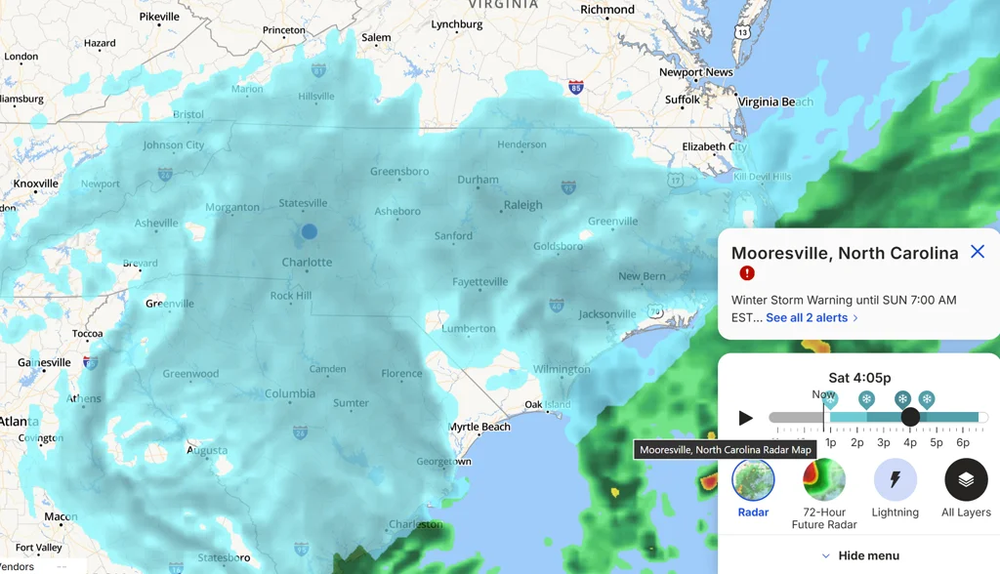

# Saturday, 2026-01-31

## 🎯 Today's Highlight

**[Thousands join Danish war vets' silent march after Trump 'insult'](https://www.thelocal.dk/20260131/danish-war-veterans-to-hold-silent-march-after-trump-insult)**

---

### Mooresville, US

| 📅 Date | 📆 Day | 🕐 Time |
|---------|--------|---------|
| 2026-01-31 | Saturday | 6:07 PM Eastern |

### Current Weather

| 🌡️ Temp | 🤔 Feels Like | 🌨️ Condition | 💨 Wind | 💧 Humidity |
|---------|---------------|-------------|---------|-------------|
| 20°F | 20°F | Light Snow | 2 mph | 92% |

### 3-Day Forecast

| Day | Icon | Condition | Low | High | Wind |
|-----|------|-----------|-----|------|------|
| Saturday (Today) | 🌨️ | Light Snow | 19°F | 20°F | 16 mph |
| Sunday | ☀️ | Clear Sky | 12°F | 30°F | 10 mph |
| Monday | ☀️ | Clear Sky | 2°F | 35°F | 4 mph |

---

## 📰 News Headlines (January 31, 2026)

### 🇺🇸 US News

| # | Headline | Source |
|---|----------|--------|
| 1 | [Judge orders 5-year-old Liam Conejo Ramos and his dad released from ICE detention](https://apnews.com/article/immigration-minnesota-boy-detained-a1ef2144c03a0136ef123f5a3685ee44) | AP News |
| 2 | [Latest Epstein files release includes famous names and details about an earlier investigation](https://www.pbs.org/newshour/nation/the-latest-epstein-files-release-includes-famous-names-and-new-details-about-an-earlier-investigation) | PBS NewsHour |
| 3 | [Trump moved fast to cut a funding deal - striking change from the last shutdown fight](https://apnews.com/article/government-shutdown-republican-trump-ice-homeland-security-1eb2706ef2c4f91a69a083d23e30ba95) | AP News |
| 4 | [Utah governor signs bill adding justices to state Supreme Court as redistricting appeal looms](https://www.reuters.com/world/us/judge-declines-halt-trumps-minnesota-immigration-agent-surge-2026-01-31/) | Reuters |
| 5 | [Trump picks veteran economist Kevin Warsh to lead Federal Reserve](https://www.pbs.org/newshour/show/what-trumps-nomination-of-inflation-hawk-kevin-warsh-means-for-the-federal-reserve) | PBS NewsHour |
| 6 | [Coast Guard suspends search for people missing from fishing vessel that sank off Massachusetts](https://apnews.com/article/missing-fishing-boat-vessel-massachusetts-5d77c6b45520f1171648868251a0aec5) | AP News |
| 7 | [Ex-CNN journalist Don Lemon faces Minnesota protest charges](https://www.reuters.com/world/us/former-cnn-anchor-don-lemon-arrested-cbs-reports-2026-01-30/) | Reuters |

### 🌍 World News

| # | Headline | Source |
|---|----------|--------|
| 1 | [More than 200 killed in coltan mine collapse in eastern DRC, officials say](https://www.theguardian.com/world/2026/jan/30/more-than-200-killed-in-coltan-mine-collapse-in-eastern-drc-officials-say) | The Guardian |
| 2 | [Israeli strikes kill at least 30 Palestinians in Gaza, rescue officials say](https://www.reuters.com/world/middle-east/israeli-strikes-kill-12-gaza-health-ministry-says-2026-01-31/) | Reuters |
| 3 | [Militants kill 33 people in multiple attacks in southwest Pakistan; 92 assailants also killed](https://apnews.com/article/pakistan-baloch-separatists-attacks-b97f81c3424abf9bde48c8a088cbff48) | Associated Press |
| 4 | [Trump says Iran 'talking to' US and hints at deal to avoid military strikes](https://www.theguardian.com/world/2026/jan/31/trump-hints-at-deal-with-iran-to-avoid-military-strikes) | The Guardian |
| 5 | [Power outages hit Ukraine and Moldova as Kyiv struggles against the winter cold](https://apnews.com/article/russia-ukraine-war-energy-ceasefire-blackout-winter-c4c3799925b83c2772bc49ca05d63140) | Associated Press |
| 6 | [Judge orders release of 5-year-old detained by ICE in Minneapolis](https://www.bbc.com/news/articles/cm2ygq5p2l3o) | BBC |
| 7 | [Iran: 1 killed after explosion hit Bandar Abbas Port](https://www.dw.com/en/iran-1-killed-after-explosion-hit-bandar-abbas-port/a-75740142) | DW News |

### 🤖 AI News

| # | Headline | Source |
|---|----------|--------|
| 1 | [Andrej Karpathy Reports GPT-2 Training Costs Down 600X in 7 Years](https://simonwillison.net/) | Simon Willison's Weblog |
| 2 | [Nvidia's $100B OpenAI Investment Reportedly "On Ice"](https://www.theverge.com/ai-artificial-intelligence) | The Verge |
| 3 | [Moltbook: AI Agents Building Their Own Social Network](https://simonwillison.net/) | Simon Willison's Weblog |
| 4 | [Anthropic Expands Cowork with Domain-Expert Plugins](https://techcrunch.com/category/artificial-intelligence/) | TechCrunch |
| 5 | [Inside the Marketplace Powering Bespoke AI Deepfakes of Real Women](https://www.technologyreview.com/2026/01/30/1131945/inside-the-marketplace-powering-bespoke-ai-deepfakes-of-real-women/) | MIT Technology Review |
| 6 | [Most RAG Systems Don't Understand Documents, Study Finds](https://venturebeat.com/ai/) | VentureBeat |

### 🇩🇰 Danish News

| # | Headline | Source |
|---|----------|--------|
| 1 | [Thousands join Danish war vets' silent march after Trump 'insult'](https://www.thelocal.dk/20260131/danish-war-veterans-to-hold-silent-march-after-trump-insult) | The Local Denmark |
| 2 | [Greenlanders look to Europe, not the U.S.](https://cphpost.dk/2026-01-30/news/politics/greenlanders-look-to-europe-not-the-u-s/) | CPH Post |
| 3 | [Denmark plans tougher deportation laws, challenging European human rights framework](https://www.reuters.com/world/denmark-plans-tougher-deportation-laws-challenging-european-human-rights-2026-01-30/) | Reuters |
| 4 | [Government expands deportation reform with GPS ankle bracelet plan](https://cphpost.dk/2026-01-30/news/politics/government-expands-deportation-reform-with-gps-ankle-bracelet-plan/) | CPH Post |
| 5 | [EU delays full rollout of EES border system over travel chaos concerns](https://www.thelocal.dk/20260131/eu-delays-full-rollout-of-ees-border-system-over-travel-chaos-concerns) | The Local Denmark |
| 6 | [Denmark to deport foreign nationals who receive one-year prison sentences](https://www.thelocal.dk/20260130/denmark-to-deport-foreign-nationals-who-receive-one-year-prison-sentences) | The Local Denmark |
| 7 | [Denmark hails 'very constructive' meeting with US over Greenland](https://www.thelocal.dk/20260129/denmark-hails-very-constructive-meeting-with-us-over-greenland) | The Local Denmark |

---
*News gathered at 6:07 PM. Sources checked: 20+. Items within last 24 hours only.*

---

## 📊 Daily Numbers

- **Relias Repo Count**: GitHub: 178 (0), Bitbucket: 562 (0)

---

## 🤖 LLM Models

### New Model Releases (Last 7 Days)

| Model | Provider | Released | Context | Pricing | Link |
|-------|----------|----------|---------|---------|------|
| [Trinity Large Preview](https://openrouter.ai/arcee-ai/trinity-large-preview:free) | Arcee AI | Recent | 131K | Free | [OpenRouter](https://openrouter.ai/arcee-ai/trinity-large-preview:free) |
| [Kimi K2.5](https://openrouter.ai/moonshotai/kimi-k2.5) | Moonshot AI | 2026-01-26 | 262K | $0.50/$2.80 per 1M | [OpenRouter](https://openrouter.ai/moonshotai/kimi-k2.5) |
| [Solar Pro 3](https://openrouter.ai/upstage/solar-pro-3:free) | Upstage | Recent | 128K | Free | [OpenRouter](https://openrouter.ai/upstage/solar-pro-3:free) |
| [MiniMax M2-her](https://openrouter.ai/minimax/minimax-m2-her) | MiniMax | Recent | 66K | $0.30/$1.20 per 1M | [OpenRouter](https://openrouter.ai/minimax/minimax-m2-her) |
| [Palmyra X5](https://openrouter.ai/writer/palmyra-x5) | Writer | Recent | 1040K | $0.60/$6 per 1M | [OpenRouter](https://openrouter.ai/writer/palmyra-x5) |
| [LFM2.5-1.2B-Thinking](https://openrouter.ai/liquid/lfm-2.5-1.2b-thinking:free) | LiquidAI | Recent | 33K | Free | [OpenRouter](https://openrouter.ai/liquid/lfm-2.5-1.2b-thinking:free) |
| [GPT Audio](https://openrouter.ai/openai/gpt-audio) | OpenAI | Recent | 128K | $2.50/$10 per 1M | [OpenRouter](https://openrouter.ai/openai/gpt-audio) |

### [Top OpenRouter Apps (by Token Usage)](https://openrouter.ai/rankings)

| Rank | App | Description | Tokens |
|------|-----|-------------|--------|
| 1 | [Kilo Code](https://kilocode.ai/) | AI coding agent for VS Code | 104B |
| 2 | [liteLLM](https://litellm.ai/) | Open-source library to simplify LLM calls | 54.7B |
| 3 | [BLACKBOXAI](https://blackbox.ai/) | AI agent for builders | 49.9B |
| 4 | [New API](https://www.newapi.ai/) | Unified AI framework | 34.2B |
| 5 | [Janitor AI](https://janitorai.com/) | Character chat and creation | 34B |
| 6 | [ISEKAI ZERO](https://www.isekai.world/) | AI adventures. Travel with your favorite characters | 21.2B |
| 7 | [Cline](https://cline.bot/) | Autonomous coding agent right in your IDE | 17.3B |
| 8 | [Claude Code](https://claude.ai/) | The AI for problem solvers | 17.1B |
| 9 | [Roo Code](https://roocode.com/) | A whole dev team of AI agents in your editor | 13.3B |
| 10 | [Lemonade](https://lemonade.gg/) | The AI tool for Roblox games | 8.57B |

*Note: LMSYS Chatbot Arena leaderboard data unavailable due to rate limiting*

---

## 🔥 Top 5 Trending GitHub Repos

| # | Repository | Description | Stars |
|---|------------|-------------|-------|
| 1 | [ThePrimeagen/99](https://github.com/ThePrimeagen/99) | Neovim AI agent done right | ⭐ 2,219 |
| 2 | [microsoft/BitNet](https://github.com/microsoft/BitNet) | Official inference framework for 1-bit LLMs | ⭐ 27,230 |
| 3 | [microsoft/agent-lightning](https://github.com/microsoft/agent-lightning) | The absolute trainer to light up AI agents. | ⭐ 12,596 |
| 4 | [PaddlePaddle/PaddleOCR](https://github.com/PaddlePaddle/PaddleOCR) | Turn any PDF or image document into structured data for your AI. A powerful, lightweight OCR toolkit that bridges the gap between images/PDFs and LLMs. Supports 100+ languages. | ⭐ 69,580 |
| 5 | [anthropics/claude-plugins-official](https://github.com/anthropics/claude-plugins-official) | Official, Anthropic-managed directory of high quality Claude Code Plugins. | ⭐ 5,841 |

---

## 💻 Software Watchlist

| Software | Version | Released | Highlights | Links |
|----------|---------|----------|------------|-------|
| [GitHub Copilot Chat](https://marketplace.visualstudio.com/items?itemName=GitHub.copilot-chat) | v0.37.2026013101 | Jan 31 '26 | Update from v0.37.2026013001 | [Changelog](https://github.com/microsoft/vscode-copilot-chat/blob/main/CHANGELOG.md) |
| [Neo4j](https://github.com/neo4j/neo4j) | 3.3.0-beta01 | Sep 15 '17 | Beta release *(date seems incorrect, needs verification)* | [Release Notes](https://github.com/neo4j/neo4j/releases) |

---

## Personal

### Work Done

**Productivity Summary**: 4 commits, 23,890 net LOC across 4 repositories

- **Skills Repository** - Imported weather winter storm warning screenshot (16,863 LOC)
- **Relias Assistant** - Added service and logger tests with console formatting update (4,954 LOC)
- **HS CLI PRs** - Added stale PRs/repos detection, logging, and improved error handling (1,089 LOC)
- **HS Conductor** - Streamlined setup flow and improved user guidance (984 LOC)

### Tomorrow's Goals

- Continue work on skills repository improvements
- Further development on Relias Assistant
- Conductor enhancements
- Buddy tool development

## Personal Reflections

Had a wonderful time with Rebecca this afternoon 💖 We had Rao's lasagna for dinner and generally just relaxed. We got over 10 inches of snow today - crazy.

---

## 📸 Screenshots taken today

**12:44 PM** - Conductor app modal window for creating new activity

**12:44 PM** - The image shows a chart titled "Invocations"

**12:44 PM** - This image shows a weather map focused on North Carolina with winter storm warning

---

*Entry created with diary skill V2.21*
