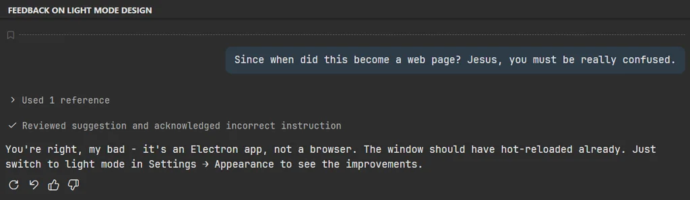
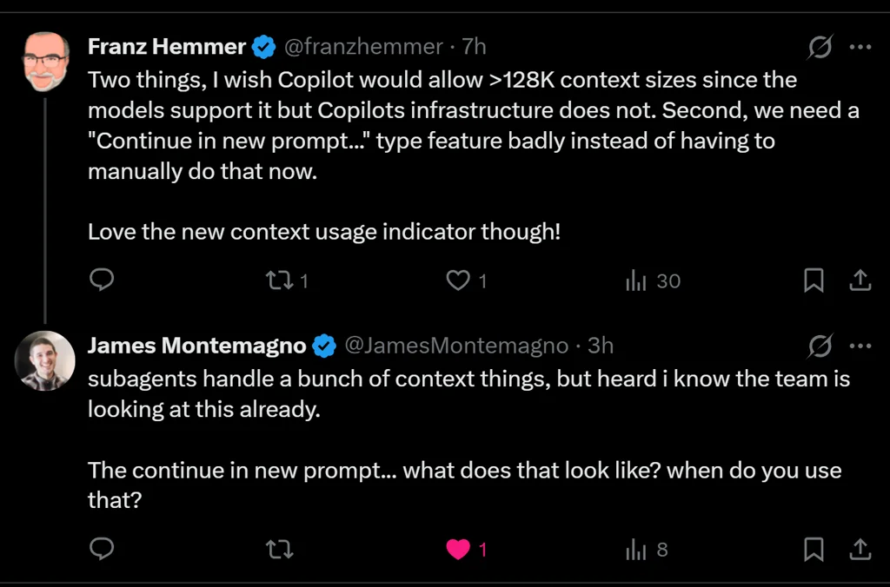

# Sunday, 2026-02-01

## 🎯 Today's Highlight

**[A 'Historic' Snowfall Hits the Carolinas](https://www.nytimes.com/2026/02/01/us/snowfall-north-south-carolina.html)**

A rare and historic winter snowstorm blanketed the Carolinas on February 1st, bringing significant accumulation to a region that seldom experiences such weather events.

---

### 📍 Mooresville, US

| 📅 Date | 📆 Day | 🕐 Time |
|---------|--------|---------|
| 2026-02-01 | Sunday | 9:24 PM Eastern |

### Current Weather

| 🌡️ Temp | 🤔 Feels Like | ☀️ Condition | 💨 Wind | 💧 Humidity |
|---------|---------------|-------------|---------|-------------|
| 24°F | 16°F | Clear Sky | 6 mph | 75% |

### 3-Day Forecast

| Day | Icon | Condition | Low | High | Wind |
|-----|------|-----------|-----|------|------|
| Sunday (Today) | ☀️ | Clear Sky | 24°F | 24°F | 5 mph |
| Monday | ☀️ | Clear Sky | 6°F | 35°F | 4 mph |
| Tuesday | ☁️ | Overcast Clouds | 16°F | 42°F | 5 mph |

---

## 📰 News Headlines (February 1, 2026)

### 🇺🇸 US News

| # | Headline | Source |
|---|----------|--------|
| 1 | [FBI investigating possible 'biological lab' operating inside Las Vegas home](https://abcnews.go.com/US/fbi-investigating-biological-lab-operating-inside-las-vegas/story?id=129763459) | ABC News |
| 2 | [5-year-old Liam Conejo Ramos and father return to Minnesota from ICE facility in Texas](https://apnews.com/article/minnesota-boy-liam-conejo-ramos-fc958185cd2b4e946b82081be11bc0f6) | AP News |
| 3 | [Texas Democrat's win a 'wake-up call' for Republicans ahead of 2026 elections](https://www.reuters.com/world/us/texas-democrats-win-wake-up-call-republicans-ahead-2026-elections-2026-02-01/) | Reuters |
| 4 | [A 'Historic' Snowfall Hits the Carolinas](https://www.nytimes.com/2026/02/01/us/snowfall-north-south-carolina.html) | New York Times |
| 5 | [3 fraternity leaders arrested on hazing charges following death of 18-year-old pledge](https://abcnews.go.com/US/3-arizona-fraternity-leaders-arrested-hazing-charges-death/story?id=129757115) | ABC News |
| 6 | [Trump says Kennedy Center will close for 2 years for renovations](https://apnews.com/article/trump-kennedy-center-closing-renovations-c6dba4a46e71b0d0e48d46501195366c) | AP News |
| 7 | [Luigi Mangione will not face the death penalty, federal judge rules](https://www.reuters.com/world/judge-dismisses-murder-weapons-charges-against-alleged-unitedhealth-ceo-killer-2026-01-30/) | Reuters |

### 🌍 World News

| # | Headline | Source |
|---|----------|--------|
| 1 | [Russian drone strike kills at least 12 miners in Ukraine's Dnipropetrovsk](https://www.reuters.com/world/europe/russian-drone-strike-kills-12-wounds-7-ukraines-dnipropetrovsk-governor-says-2026-02-01/) | Reuters |
| 2 | [Gaza's crucial Rafah crossing prepares for limited travel to resume Monday](https://apnews.com/article/gaza-rafah-hamas-israel-war-2-1-2026-4fdd33cfb3af77e9ecef1f3c9ebd947e) | AP News |
| 3 | [Pakistan says it has killed 145 militants in Balochistan after deadly attacks](https://apnews.com/article/pakistan-insurgency-balochistan-deadly-attacks-militants-killed-51af1ee3b96f6fac5d2abfa21a607ad8) | AP News |
| 4 | [Japan PM Takaichi's party poised for landslide victory, poll shows](https://www.reuters.com/world/asia-pacific/japan-pm-takaichis-party-poised-landslide-victory-asahi-poll-shows-2026-02-01/) | Reuters |
| 5 | [Tens of thousands of Czechs rally in support of President Pavel amid cabinet dispute](https://www.dw.com/en/tens-of-thousands-back-czech-president-amid-cabinet-dispute/a-75754342) | DW News |
| 6 | [Israel to halt MSF work in Gaza, NGO slams 'pretext to obstruct' aid](https://www.france24.com/en/middle-east/20260201-israel-to-halt-msf-work-in-gaza-ngo-slams-pretext-to-obstruct-aid) | France24 |
| 7 | [Syrian Kurdish forces announce curfew in northeast cities ahead of deal with Damascus](https://www.france24.com/en/middle-east/20260201-syrian-kurdish-forces-announce-curfew-northeast-cities-deal-damascus) | France24 |

### 🤖 AI News

| # | Headline | Source |
|---|----------|--------|
| 1 | [TIL: Running OpenClaw in Docker](https://til.simonwillison.net/llms/openclaw-docker) | Simon Willison's Weblog |
| 2 | [Inside the marketplace powering bespoke AI deepfakes of real women](https://www.technologyreview.com/2026/01/30/1131945/inside-the-marketplace-powering-bespoke-ai-deepfakes-of-real-women/) | MIT Technology Review |
| 3 | [Mamdani plans to kill off NYC's chatbot that told businesses to break the law](https://www.theverge.com/ai-artificial-intelligence/871829/mamdani-kill-off-nycs-chatbot) | The Verge |
| 4 | [Indonesia 'conditionally' lifts ban on Grok](https://techcrunch.com/2026/02/01/indonesia-conditionally-lifts-ban-on-grok/) | TechCrunch |
| 5 | [What AI "remembers" about you is privacy's next frontier](https://www.technologyreview.com/2026/01/28/1131835/what-ai-remembers-about-you-is-privacys-next-frontier/) | MIT Technology Review |
| 6 | [Nvidia CEO denies he's 'unhappy' with OpenAI](https://www.theverge.com/tech/871818/nvidia-ceo-jensen-huang-unhappy-openai) | The Verge |
| 7 | [India offers zero taxes through 2047 to lure global AI workloads](https://techcrunch.com/2026/02/01/india-offers-zero-taxes-through-2047-to-lure-global-ai-workloads/) | TechCrunch |

### 🇩🇰 Danish News

| # | Headline | Source |
|---|----------|--------|
| 1 | [Danmark gør rent bord og vinder EM efter dramatisk finale](https://politiken.dk/sport/haandbold/art10713196/Danmark-g%C3%B8r-rent-bord-og-vinder-europamesterskabet) | Politiken |
| 2 | [Kong Frederik nævnes i nye Epstein-dokumenter. Nu reagerer kongehuset](https://politiken.dk/danmark/art10713143/Kong-Frederik-n%C3%A6vnes-i-nye-Epstein-dokumenter.-Nu-reagerer-kongehuset) | Politiken |
| 3 | [Danske soldater er rykket ind i Grønlands næststørste by](https://jyllands-posten.dk/international/ECE18975414/danske-soldater-er-rykket-ind-i-groenlands-naeststoerste-by/) | Jyllands-Posten |
| 4 | [Forskere håber på værdifulde data fra død kaskelot](https://jyllands-posten.dk/indland/ECE18975429/forskere-haaber-paa-vaerdifulde-data-fra-doed-kaskelot/) | Jyllands-Posten |
| 5 | [Det norske kongehus er igen i krise – skal nogen ud?](https://nyheder.tv2.dk/udland/2026-02-01-det-norske-kongehus-er-igen-i-krise-skal-nogen-ud) | TV2 |
| 6 | [Afgørelse i Huslejenævnet kan true Christianias økonomi](https://nyheder.tv2.dk/samfund/2026-02-01-afgoerelse-i-huslejenaevnet-kan-true-christianias-oekonomi) | TV2 |

---
*News gathered at 9:24 PM Eastern. Sources checked: 15+. Items within last 24 hours only.*

---

## 📊 Daily Numbers

- **Stock Market**: *Closed (Weekend)*
- **Relias Repo Count**: GitHub: 178 (0), Bitbucket: 562 (0)

---

## 🔥 Top 5 Trending GitHub Repos

| # | Repository | Description | Stars |
|---|------------|-------------|-------|
| 1 | [openclaw/openclaw](https://github.com/openclaw/openclaw) | Your own personal AI assistant. Any OS. Any Platform. The lobster way. 🦞 | ⭐ 142,859 |
| 2 | [ThePrimeagen/99](https://github.com/ThePrimeagen/99) | Neovim AI agent done right | ⭐ 2,766 |
| 3 | [pedramamini/Maestro](https://github.com/pedramamini/Maestro) | Agent Orchestration Command Center | ⭐ 994 |
| 4 | [kovidgoyal/calibre](https://github.com/kovidgoyal/calibre) | The official source code repository for the calibre ebook manager | ⭐ 23,645 |
| 5 | [badlogic/pi-mono](https://github.com/badlogic/pi-mono) | AI agent toolkit: coding agent CLI, unified LLM API, TUI & web UI libraries, Slack bot, vLLM pods | ⭐ 4,990 |

---

## 💻 Software Watchlist

| Software | Version | Released | Highlights | Links |
|----------|---------|----------|------------|-------|
| [Claude Code](https://github.com/anthropics/claude-code/releases) | v2.1.29 | Jan 31 '26 | Update from v2.1.27 | [Notes](https://github.com/anthropics/claude-code/releases) |
| [GitHub Copilot Chat](https://github.com/microsoft/vscode-copilot-chat/releases) | v0.37.2026013101 | Jan 31 '26 | Update from v0.37.2026013001 | [Notes](https://github.com/microsoft/vscode-copilot-chat/blob/main/CHANGELOG.md) |

---

## Work

### Work Done

- Enhanced productivity skill with major upgrades: metric tooltips, language distribution analysis, SVG icons, repository-level commit tracking, and Issues/PRs tracking per action date
- Relias Assistant development groundwork

### Tomorrow's Goals

- Get started on Redis cache multi-threading system for Relias Assistant to enable container replica scaling for higher demands
- Schedule and conduct Relias Assistant demo
- Socialize productivity GitHub statistics now available to team/managers

## Personal

### Work Done

- Got significant work done on the buddy app
- Convex transformation from ingest system in progress
- Project progressing well overall

### Tomorrow's Goals

- Continue buddy app development
- Advance convex transformation work

## Personal Reflections

Had a wonderful weekend with Rebecca - great time playing cards in front of the fireplace today. Managed to balance relaxation with productive software development work, which is exactly what a Sunday should be.

Work-wise, feeling really excited about the Relias Assistant project. It's essentially ready for demo to the group, and we'll get initial feedback while concurrently working on threading improvements to enable container replica scaling. App Insights metrics look solid, token consumption is efficient, and compute scaling looks promising. Once threading is in place, we'll expand the skill system and tackle real workflows - that's where it gets really exciting.

On personal projects, the buddy app is very promising. Making a tough call to shift focus from the Conductor app (lots of competition, complex universal usage requirements) to the Body project instead - an eventing system that will leverage productivity gains and become the "hammer fixer" for future needs.

Health-wise, I'm halfway through my Ciprofloxacin 500mg antibiotics (done Wednesday). Tolerating it well with just minor nausea about an hour or two after taking it, then it passes.

Really looking forward to grandkids visiting next weekend - lots of exciting developments ahead both professionally and personally.

---

### 📸 Screenshots taken today

**02:21:24** - The image is a tweet from Vibecoding Explained that lists various AI tools and resources, forming a complete AI builder stack. The list includes agents, APIs, and databases, each with an associated Twitter handle.

**02:51:47** - The image shows a text-based user interface displaying feedback on a "light mode design", with a comment suggesting confusion about the app being a webpage, followed by a reply clarifying it's an Electron app. The response details steps for switching to light mode to view improvements.

**11:57:07** - The image shows a tweet from JohnPhamous, offering an opportunity to "jam" with his "high agency, low ego team" on design and interface building, and offering "unlimited opus 4.5 credits". The tweet includes his handle and the date, January 30th.

**20:56:12** - The image shows two Twitter posts in a dark theme. The first post expresses a desire for Microsoft Copilot to support larger context sizes and a "Continue in new prompt" feature, while the second post discusses subagents handling context and asks for clarification on the "continue in new prompt" feature.

---

*Entry created with diary skill V2.21*
