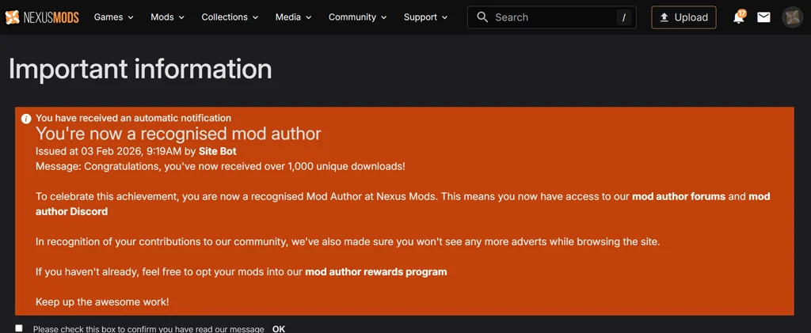

# Wednesday, 2026-02-11

## 🎯 Today's Highlight

**[Epstein files took center stage at Bondi's oversight hearing. Here are 3 big moments](https://www.pbs.org/newshour/politics/epstein-files-took-center-stage-at-bondis-oversight-hearing-here-are-3-big-moments)**

### 💬 Slack Activity

- **[#rae-beta-test](https://relias-engineering.slack.com/archives/rae-beta-test)**: Malia Paul testing RAE for JIRA automation — tagged Franz for assistance
- **[#prod-eng-devex-private](https://relias-engineering.slack.com/archives/C09LB1CM1BK)**: Congratulated Bryan on getting SonarQube on SSO; discussed Ajith communication issue and a stale gating PR that Bryan will close
- **[#productivity-engineering-public](https://relias-engineering.slack.com/archives/productivity-engineering-public)**: David Atkinson wants Copilot training — Malia scheduling 15-minute session for Friday; extensive thread (22 messages) on productivity tooling discussions
- **[#courses](https://relias-engineering.slack.com/archives/courses)**: Jason Goodyke announced course list performance work in dev1 — backend search/filter/sort with pagination, contact Divided by 0 team for issues
- **[#next-deployment](https://relias-engineering.slack.com/archives/C1KAS0YJ3)**: Release branches cut for 26.Q1.2 RPLAT deployment; Cypress and manual verification completed for DE; Physicians and WCEI Craft & Magento release planned for tomorrow
- **[#relias-engineering](https://relias-engineering.slack.com/archives/G019Q7P5J73)**: King Cake in the break room on 4th floor; Yuhua and Lakshmi discussing trackpad touch issues (not unique)
- **[#dev-tribe](https://relias-engineering.slack.com/archives/C1KAF274N)**: Release branches cut for 26.Q1.2; Ashley Edds requesting on-call support for several teams; Clark reminding teams to verify merged tickets for sprint
- **[#platform](https://relias-engineering.slack.com/archives/platform)**: Debate on whether admin should be allowed to add more seats beyond max — Jonatan, Katherine, and Jessica Ryan coordinating on Live Events work
- **DMs**: Ashley Edds finished skill PR changes; Geo Rufino pointed out presentation was on wrong branch (not main); Malia Paul provided two updates including Friday skills workshop viewing and pushing forward on Slack token access

---

### 📍 Mooresville, US

| 📅 Date | 📆 Day | 🕐 Time |
|---------|--------|---------|
| 2026-02-11 | Wednesday | 8:00 AM Eastern |

### Current Weather

| 🌡️ Temp | 🤔 Feels Like | ☁️ Condition | 💨 Wind | 💧 Humidity |
|---------|---------------|-------------|---------|-------------|
| 56°F | 55°F | Overcast Clouds | 6 mph | 81% |

### 3-Day Forecast

| Day | Icon | Condition | Low | High | Wind |
|-----|------|-----------|-----|------|------|
| Wednesday (Today) | ☁️ | Broken Clouds | 44°F | 63°F | 10 mph |
| Thursday | ☁️ | Broken Clouds | 33°F | 53°F | 6 mph |
| Friday | ☁️ | Broken Clouds | 30°F | 52°F | 4 mph |

---

## 📰 News Headlines (February 11, 2026)

### 🇺🇸 US News

| # | Headline | Source |
|---|----------|--------|
| 1 | [U.S. ice dancers Madison Chock and Evan Bates win Olympic silver, in a stunning upset](https://www.npr.org/2026/02/11/nx-s1-5711198/madison-chock-evan-bates-ice-dance-olympics-france) | NPR |
| 2 | [Epstein files took center stage at Bondi's oversight hearing. Here are 3 big moments](https://www.pbs.org/newshour/politics/epstein-files-took-center-stage-at-bondis-oversight-hearing-here-are-3-big-moments) | PBS NewsHour |
| 3 | [AI brings Supreme Court decisions to life](https://www.npr.org/2026/02/11/nx-s1-5711607/supreme-court-ai) | NPR |
| 4 | [What caused the sudden and confusing closure of El Paso's airspace](https://www.pbs.org/newshour/show/what-caused-the-sudden-and-confusing-closure-of-el-pasos-airspace) | PBS NewsHour |

### 🌍 World News

| # | Headline | Source |
|---|----------|--------|
| 1 | [Despite Trump's threats, six House Republicans side with Democrats in effort to end tariffs on Canada – live](https://www.theguardian.com/us-news/live/2026/feb/11/donald-trump-benjamin-netanyahu-israel-iran-jeffrey-epstein-jobs-economy-us-politics-live-news-updates) | The Guardian |
| 2 | [Australia politics live: Angus Taylor confirms leadership challenge promising 'clarity, courage and confidence' after spill motion delivered to Ley](https://www.theguardian.com/australia-news/live/2026/feb/12/australia-politics-live-liberals-leadership-spill-challenge-angus-taylor-sussan-ley-libspill-question-time-anthony-albanese-senate-estimates-ntwnfb) | The Guardian |
| 3 | ['Nothing definitive' reached about Iran during Netanyahu's visit with Trump](https://www.aljazeera.com/news/2026/2/12/nothing-definitive-reached-about-iran-during-netanyahus-visit-with-trump?traffic_source=rss) | Al Jazeera |
| 4 | [The Dutch love four-day working weeks, but are they sustainable?](https://www.bbc.com/news/articles/cx2y85xdyw3o?at_medium=RSS&at_campaign=rss) | BBC |
| 5 | [Bangladesh election 2026 live news: Polls to open amid heavy security](https://www.aljazeera.com/news/liveblog/2026/2/11/bbangladesh-election-2026-live-news-polls-open-shortly-amid-heavy-security?traffic_source=rss) | Al Jazeera |
| 6 | [France's Cizeron, Fournier Beaudry win ice dance gold at 2026 Olympics](https://www.france24.com/en/sport/20260211-france-cizeron-fournier-beaudry-win-olympic-2026-ice-dance-gold) | France 24 |
| 7 | [Police identify 18-year-old as suspect in Tumbler Ridge shooting](https://www.bbc.com/news/articles/ce8w95knp55o?at_medium=RSS&at_campaign=rss) | BBC |

### 🤖 AI News

| # | Headline | Source |
|---|----------|--------|
| 1 | [Quoting Andrew Deck for Niemen Lab](https://simonwillison.net/2026/Feb/11/manosphere-report/#atom-everything) | Simon Willison's Weblog |
| 2 | [Skills in OpenAI API](https://simonwillison.net/2026/Feb/11/skills-in-openai-api/#atom-everything) | Simon Willison's Weblog |
| 3 | [xAI lays out interplanetary ambitions in public all-hands](https://techcrunch.com/2026/02/11/xai-lays-out-interplanetary-ambitions-in-public-all-hands/) | TechCrunch |
| 4 | [AI inference startup Modal Labs in talks to raise at $2.5B valuation, sources say](https://techcrunch.com/2026/02/11/ai-inference-startup-modal-labs-in-talks-to-raise-at-2-5b-valuation-sources-say/) | TechCrunch |
| 5 | [Once-hobbled Lumma Stealer is back with lures that are hard to resist](https://arstechnica.com/security/2026/02/once-hobbled-lumma-stealer-is-back-with-lures-that-are-hard-to-resist/) | Ars Technica |
| 6 | [OpenAI researcher quits over ChatGPT ads, warns of "Facebook" path](https://arstechnica.com/information-technology/2026/02/openai-researcher-quits-over-fears-that-chatgpt-ads-could-manipulate-users/) | Ars Technica |
| 7 | [Is a secure AI assistant possible?](https://www.technologyreview.com/2026/02/11/1132768/is-a-secure-ai-assistant-possible/) | MIT Technology Review |

### 🇩🇰 Danish News

| # | Headline | Source |
|---|----------|--------|
| 1 | [18-årig kvinde mistænkt for masseskyderi i Canada](https://www.dr.dk/nyheder/seneste/18-aarig-kvinde-mistaenkt-masseskyderi-i-canada) | DR News |
| 2 | [Nobelkomitéen opfordrer Iran til at løslade tidligere nobelprismodtager](https://www.dr.dk/nyheder/seneste/nobelkomiteen-opfordrer-iran-til-loeslade-tidligere-nobelprismodtager) | DR News |
| 3 | [Convicted killer has been at large for a week](https://cphpost.dk/2026-02-11/news/round-up/convicted-killer-has-been-at-large-for-a-week/) | CPH Post |
| 4 | [Danske Bank to offer cryptocurrency investment products](https://cphpost.dk/2026-02-11/news/round-up/danske-bank-to-offer-cryptocurrency-investment-products/) | CPH Post |

---
*News gathered at 8:00 AM Eastern. Sources checked: 15+. Items within last 24 hours only.*

---

## 📊 Daily Numbers

- **Dow Jones**: 501.33 (-0.57, -0.11%) *(DIA ETF)*
- **S&P 500**: 691.96 (-0.16, -0.02%) *(SPY ETF)*
- **Relias Repo Count**: GitHub: 184 (+2), Bitbucket: 562 (0)

---

## 🤖 LLM Models

### LMSYS Chatbot Arena Leaderboard

*No changes from yesterday — Coding top 5 remains: Claude Opus 4.6 Thinking, Claude Opus 4.6, Gemini 3 Pro, Claude Opus 4.5 Thinking 32K, Claude Opus 4.5. Overall and Vision unchanged.*

*Leaderboard source: [LMSYS Chatbot Arena](https://lmarena.ai/leaderboard)*

### New Model Releases (Last 7 Days: Feb 4-11, 2026)

| Model | Provider | Released | Context | Pricing | Link |
|-------|----------|----------|---------|---------|------|
| GLM 5 | Z.ai | Feb 11 | 203K | $1.00/$3.20 per 1M | [OpenRouter](https://openrouter.ai/z-ai/glm-5) |
| Qwen3 Max Thinking | Qwen | Feb 9 | 262K | $1.20/$6.00 per 1M | [OpenRouter](https://openrouter.ai/qwen/qwen3-max-thinking) |
| Aurora Alpha | OpenRouter | Feb 9 | 128K | Free | [OpenRouter](https://openrouter.ai/openrouter/aurora-alpha) |
| Claude Opus 4.6 | Anthropic | Feb 4 | 1M | $5/$25 per 1M | [OpenRouter](https://openrouter.ai/anthropic/claude-opus-4.6) |

### Top OpenRouter Apps (by Token Usage)

*No ranking changes from yesterday*

| Rank | App | Description | Tokens | Change |
|------|-----|-------------|--------|--------|
| 1 | OpenClaw | The AI that actually does things | 199B | − |
| 2 | Kilo Code | AI coding agent for VS Code | 114B | − |
| 3 | BLACKBOXAI | AI agent for builders | 50.6B | − |
| 4 | liteLLM | Open-source library to simplify LLM calls | 48.6B | − |
| 5 | Janitor AI | Character chat and creation | 33.4B | − |
| 6 | Claude Code | The AI for problem solvers | 25.5B | − |
| 7 | Cline | Autonomous coding agent in your IDE | 25.4B | − |
| 8 | ISEKAI ZERO | AI adventures with favorite characters | 23.5B | − |
| 9 | New API | Unified AI framework | 15.2B | − |
| 10 | Roo Code | Dev team of AI agents in editor | 14.7B | − |

*Source: [OpenRouter App Rankings](https://openrouter.ai/rankings/apps)*

---

## 🔥 Top 5 Trending GitHub Repos

| # | Repository | Description | Stars |
|---|------------|-------------|-------|
| 1 | [google/langextract](https://github.com/google/langextract) | A Python library for extracting structured information from unstructured text using LLMs with precise source grounding and interactive visualization | ⭐ 30,574 |
| 2 | [github/gh-aw](https://github.com/github/gh-aw) | GitHub Agentic Workflows | ⭐ 1,772 |
| 3 | [ChromeDevTools/chrome-devtools-mcp](https://github.com/ChromeDevTools/chrome-devtools-mcp) | Chrome DevTools for coding agents | ⭐ 24,035 |
| 4 | [EveryInc/compound-engineering-plugin](https://github.com/EveryInc/compound-engineering-plugin) | Official Claude Code compound engineering plugin | ⭐ 8,503 |
| 5 | [cheahjs/free-llm-api-resources](https://github.com/cheahjs/free-llm-api-resources) | A list of free LLM inference resources accessible via API | ⭐ 9,586 |

---

## 💻 Software Watchlist

| Software | Version | Released | Highlights | Links |
|----------|---------|----------|------------|-------|
| [.NET SDK](https://github.com/dotnet/sdk) | v11.0.0-preview.1 | Feb 10 '26 | First .NET 11 preview release — next major platform version entering preview cycle | [Notes](https://github.com/dotnet/sdk/releases/tag/v11.0.0-preview.1) |
| [Claude Code](https://github.com/anthropics/claude-code) | v2.1.39 | Feb 10 '26 | Improved terminal rendering performance, Fixed fatal errors being swallowed, Fixed process hanging after session close, Fixed character loss at terminal boundary, Fixed blank lines in verbose transcript | [v2.1.39](https://github.com/anthropics/claude-code/releases/tag/v2.1.39) |
| [Gemini CLI](https://github.com/google-gemini/gemini-cli) | v0.29.0-preview.0 | Feb 10 '26 | Implemented plan slash command for task planning, Added enter_plan_mode tool, Removed ask_user from non-interactive modes, Agent skills linking, Default execution limits for subagents | [Notes](https://github.com/google-gemini/gemini-cli/releases/tag/v0.29.0-preview.0) |
| [GitHub Copilot Chat](https://github.com/microsoft/vscode-copilot-chat) | v0.38.2026021105 | Feb 11 '26 | Daily pre-release extension update | [Releases](https://github.com/microsoft/vscode-copilot-chat/releases) |
| [GitHub Web](https://github.blog/changelog/) | Feb 10 '26 | Feb 10 '26 | GPT-5.3-Codex rollout paused for reliability, Fast mode for Claude Opus 4.6 in preview (2.5x faster), Claude Opus 4.6 GA for Copilot, Pinned comments on Issues, Windows Server 2025 runner image, Actions runner scale set client in preview | [Feed](https://github.blog/changelog/feed/) |
| [Neo4j](https://github.com/neo4j/neo4j-dotnet-driver) | 3.3.0-beta01 | — | Pre-release driver update (likely false positive — stale release date Sep 2017) | [Notes](https://github.com/neo4j/neo4j-dotnet-driver/releases) |
| [Node.js](https://github.com/nodejs/node) | v25.6.1 | Feb 10 '26 | Replaced cjs-module-lexer with merve for build perf, Upgraded npm to 11.9.0, Fixed Windows DNS SRV ECONNREFUSED with c-ares fallback, Slab allocation for HTTP header parsing, Updated undici to 7.21.0 | [Notes](https://github.com/nodejs/node/releases/tag/v25.6.1) |
| [VS Code](https://github.com/microsoft/vscode) | 1.109.2 | Feb 10 '26 | January 2026 Recovery 2 — stability and bug fixes following 1.109.1 security patch | [Notes](https://github.com/microsoft/vscode/releases/tag/1.109.2) |

---

## 💻 Today's Productivity

| Metric | Count |
|--------|-------|
| Lines of Code | — |
| Commits | 2 |
| Pull Requests | 0 |
| Code Reviews | 0 |
| Issues Closed | 0 |

**Repositories**: skills  
**File Types**: .ps1, .md  

*Created Get-TodayProductivity.ps1 script, added diary output caching scripts and news skill*

---

## Work

### Work Done

- Had a good Agent Skills #2 Workshop where we explored relias-engineering/ai-skills and copied over one skill "repo-audit" and tested it. Next time we'll do one more and create a new skill.

### Tomorrow's Goals

- Work on RAE Atlassian/JIRA Skill.

## Personal Reflections

Landlord Jake installed a new water-heater without bringing it up to code. Remains to be seen if it works. Haven't showered in who knows how long now.

---

### 📸 Screenshots taken today

**2026-02-11 09:27** - Recognized mod author on NexusMods

---

*Entry created with diary skill V2.27*
