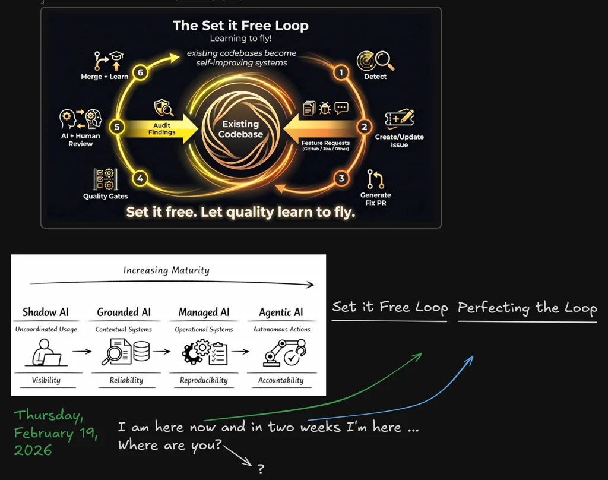
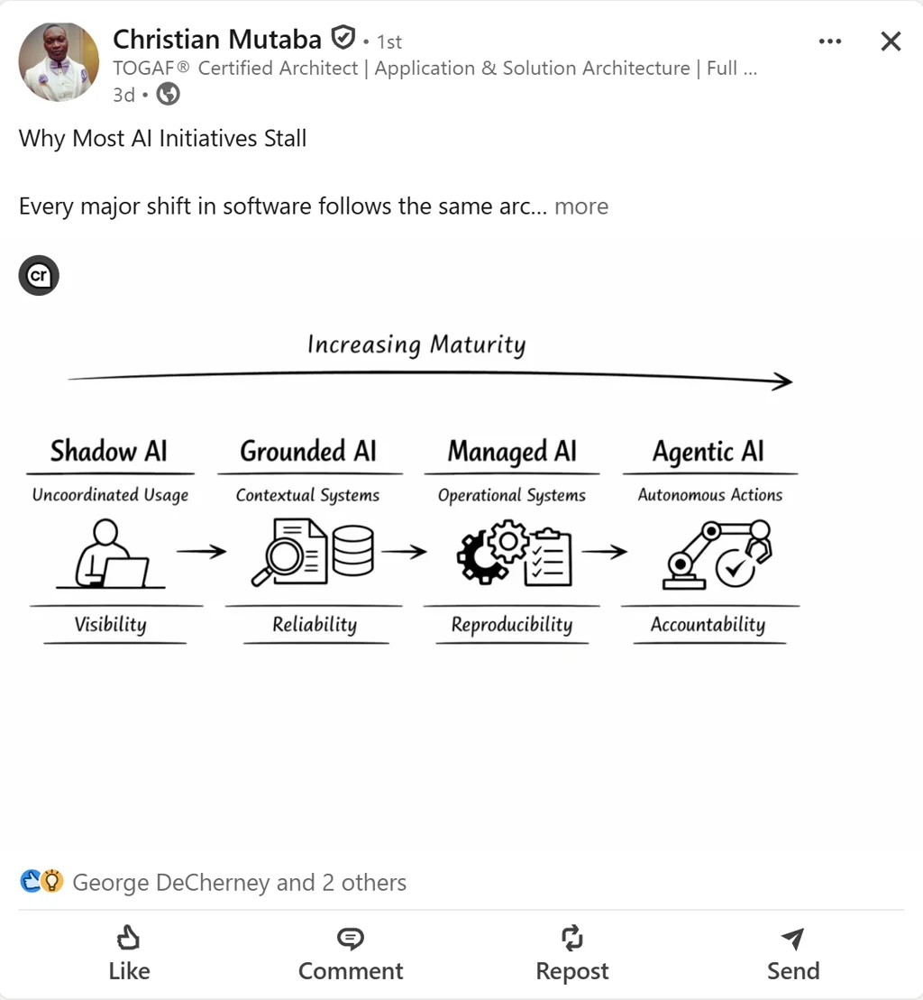
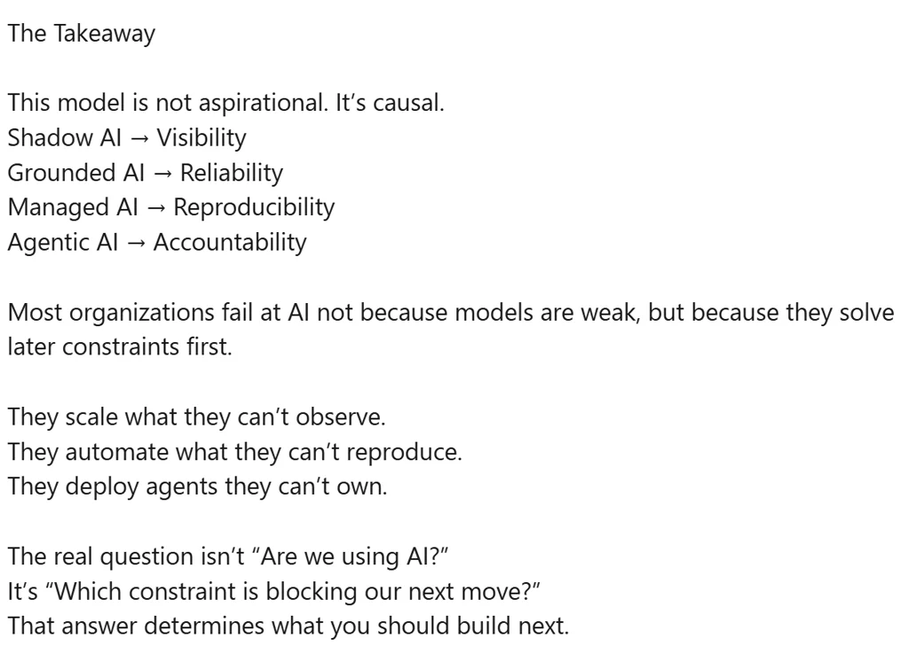

# Thursday, 2026-02-19

## 🎯 Today's Highlight

**[Google's new Gemini Pro model has record benchmark scores—again](https://techcrunch.com/2026/02/19/googles-new-gemini-pro-model-has-record-benchmark-scores-again/)**

Google released Gemini 3.1 Pro today, setting new records on frontier benchmarks. Geo was already monitoring it in the AI Chapter Slack — and the team joked "Almost 48 hours without a new frontier model." Franz also flipped the switch to add it to the AI API pool.

### 💬 Slack Activity

- **Bryan Halterman (16 DMs)**: IT discussion about enabling Microsoft Foundry models for the broader team; Wes delegating AI model access decisions to Bryan's group going forward
- **Christopher LaGant (2 DMs)**: Wants to schedule time next week to set up GitHub for the PM team — created a PM team on GitHub but can't add repos yet
- **Malia Paul (2 DMs)**: Scheduling a meeting with Henryk on Monday; Franz optional if already present
- **Todd Southwell (4 DMs)**: tsouthwell-bot-1 proactively reached out; discussion about bot awareness and turning off messages
- **#ai-chapter (13 msgs)**: Franz flipped the switch on Sonnet 4.6 for the AI API pool; Geo monitoring newly-released Gemini 3.1 Pro; overage cost warning — $100 threshold, Opus models discouraged if near limit; Geo shared DeepMind's Lyria music generation model; "Almost 48 hours without a new frontier model" joke from the group
- **#productivity-engineering-public (10 msgs)**: Cypress agent incorrectly flagging chaining after `.should()`; Tyler clarified `.should()` is not DOM-altering so the agent flag is wrong; Sumit Joshi opened PR #1241 for rlms-website
- **#dev-tribe (8 msgs)**: Notification delivery service + policy pro pipeline failing for 5+ hours (Nitin); Josh DiCristo asked about audit-service fix version; Henryk working on audit-service deployment; Malia proposing deployment frequency increase to twice weekly; Kelly updating microservice deployment process
- **#next-deployment (2 msgs)**: Hotfix deployed and verified in Prod DE (Scott Sill + Shilpa)
- **#relias-engineering (4 msgs)**: Atlassian issues suspected (Confluence/Jira down); Amha shared something interesting

---

### 📍 Mooresville, US

| 📅 Date | 📆 Day | 🕐 Time |
|---------|--------|---------|
| 2026-02-19 | Thursday | 8:13 PM Eastern |

### Current Weather

| 🌡️ Temp | 🤔 Feels Like | ⛅ Condition | 💨 Wind | 💧 Humidity |
|---------|---------------|--------------|---------|-------------|
| 63°F | 63°F | Scattered Clouds | 7 mph | 76% |

### 3-Day Forecast

| Day | Icon | Condition | Low | High | Wind |
|-----|------|-----------|-----|------|------|
| Thursday (Today) | ⛅ | Scattered Clouds | 63°F | 63°F | 6 mph |
| Friday | ☁️ | Broken Clouds | 58°F | 76°F | 10 mph |
| Saturday | ☁️ | Overcast Clouds | 52°F | 62°F | 5 mph |

---

## 📰 News Headlines (February 19, 2026)

### 🇺🇸 US News

| # | Headline | Source |
|---|----------|--------|
| 1 | [Venezuela approves amnesty bill, paving way for release of hundreds of political detainees](https://www.pbs.org/newshour/world/venezuela-approves-amnesty-bill-paving-way-for-release-of-hundreds-of-political-detainees) | PBS NewsHour |
| 2 | [Judge orders takeover of Arizona prison health care operations after years of violations](https://www.pbs.org/newshour/nation/judge-orders-takeover-of-arizona-prison-health-care-operations-after-years-of-violations) | PBS NewsHour |
| 3 | [U.S. figure skater Alysa Liu said she didn't care if she medaled. She won gold](https://www.npr.org/2026/02/19/nx-s1-5719335/alysa-liu-figure-skating-gold-olympics) | NPR |
| 4 | [Internal memo details cosmetic changes and facility repairs to Kennedy Center](https://www.npr.org/2026/02/19/nx-s1-5717475/trump-kennedy-center-renovations) | NPR |

### 🌍 World News

| # | Headline | Source |
|---|----------|--------|
| 1 | [Australia news live: Taylor says he doesn't agree with Hanson's anti-Muslim comments but won't say if she should apologise](https://www.theguardian.com/australia-news/live/2026/feb/20/accc-coles-nsw-public-hearing-illegal-tobacco-angus-taylor-liberal-coalition-net-zero-anthony-albanese-labor-ntwnfb) | The Guardian |
| 2 | [Trump warns Iran 'bad things' will happen if they fail to make a 'meaningful' nuclear deal – US politics live](https://www.theguardian.com/us-news/live/2026/feb/19/donald-trump-first-board-of-peace-washington-us-politics-live) | The Guardian |
| 3 | [Argentina's striking workers clash with police over Milei labor reforms](https://www.france24.com/en/americas/20260220-argentina-striking-workers-police-milei-labor-reforms) | France 24 |
| 4 | [IMF warns Venezuela's economy and humanitarian situation is 'quite fragile'](https://www.aljazeera.com/news/2026/2/20/imf-warns-venezuelas-economy-and-humanitarian-situation-is-quite-fragile?traffic_source=rss) | Al Jazeera |
| 5 | [New Zealand vs Pakistan: T20 World Cup Super Eights – teams, start, lineups](https://www.aljazeera.com/sports/2026/2/19/new-zealand-vs-pakistan-t20-world-cup-teams-start-lineups?traffic_source=rss) | Al Jazeera |
| 6 | [Kim Jong Un opens North Korea's 9th party congress, highlights economic gains](https://www.france24.com/en/asia-pacific/20260219-kim-jong-un-north-korea-9th-party-congress-economic-gains) | France 24 |
| 7 | [Austrian climber guilty of manslaughter after leaving girlfriend on Alpine peak](https://www.dw.com/en/austrian-climber-guilty-of-manslaughter-after-leaving-girlfriend-on-alpine-peak/a-76051539?maca=en-rss-en-world-4025-xml-mrss) | DW News |

### 🤖 AI News

| # | Headline | Source |
|---|----------|--------|
| 1 | [Gemini 3.1 Pro](https://simonwillison.net/2026/Feb/19/gemini-31-pro/#atom-everything) | Simon Willison's Weblog |
| 2 | [Experimenting with sponsorship for my blog and newsletter](https://simonwillison.net/2026/Feb/19/sponsorship/#atom-everything) | Simon Willison's Weblog |
| 3 | [Google's new Gemini Pro model has record benchmark scores—again](https://techcrunch.com/2026/02/19/googles-new-gemini-pro-model-has-record-benchmark-scores-again/) | TechCrunch |
| 4 | [Nvidia deepens early-stage push into India's AI startup ecosystem](https://techcrunch.com/2026/02/19/nvidia-deepens-early-stage-push-into-indias-ai-startup-ecosystem/) | TechCrunch |
| 5 | [The Pitt has a sharp take on AI](https://www.theverge.com/entertainment/881016/hbo-the-pitt-generative-ai-charting) | The Verge |
| 6 | [Code Metal Raises $125 Million to Rewrite the Defense Industry's Code With AI](https://www.wired.com/story/vibe-coding-startup-code-metal-raises-series-b-fundraising/) | Wired |
| 7 | [Perplexity's Retreat From Ads Signals a Bigger Strategic Shift](https://www.wired.com/story/perplexity-ads-shift-search-google/) | Wired |

### 🇩🇰 Danish News

| # | Headline | Source |
|---|----------|--------|
| 1 | [Bjergbestiger dømt skyldig i kærestes død på bjerg i Østrig](https://www.dr.dk/nyheder/seneste/bjergbestiger-doemt-skyldig-i-kaerestes-doed-paa-bjerg-i-oestrig) | DR News |
| 2 | [Iran i brev til FN-chef om muligt amerikansk angreb: Baser i området vil være legitime mål](https://www.dr.dk/nyheder/seneste/iran-i-brev-til-fn-chef-om-muligt-amerikansk-angreb-baser-i-omraadet-vil-vaere-legitime-maal) | DR News |
| 3 | [Iranian-flagged container ship detained in Denmark](https://cphpost.dk/2026-02-19/news/round-up/iranian-flagged-container-ship-detained-in-denmark/) | CPH Post |
| 4 | [Four out of 10 young homeowners in Copenhagen have wealthy parents](https://cphpost.dk/2026-02-19/news/round-up/four-out-of-10-young-homeowners-in-copenhagen-have-wealthy-parents/) | CPH Post |

---
*News gathered at 8:13 PM ET. Sources checked: 8+. Items within last 24 hours only.*

---

## 📊 Daily Numbers

- **Dow Jones**: 49,395.16 (-267.50, -0.54%) ↓
- **S&P 500**: 6,861.89 (-19.42, -0.28%) ↓
- **Relias Repo Count**: GitHub: 190 (+2), Bitbucket: 562 (0)

**⚙️ Today's Productivity**

| Metric | Count |
|--------|-------|
| Lines of Code | 0 |
| Commits | 6 |
| Pull Requests | 0 |
| Code Reviews | 0 |
| Issues Closed | 0 |

*Repos: hs-buddy, now-leadership-group, set-it-free-loop | File types: .tsx, .ps1*

---

## 🤖 LLM Models

### LMSYS Chatbot Arena Leaderboard

**Overall (Top 5)** *(Updated: 2026-02-19 — changes from 2026-02-18)*

| Rank | Model | Change |
|------|-------|--------|
| 1 | claude-opus-4-6 | ↑ (was #2) |
| 2 | claude-opus-4-6-thinking | ↓ (was #1) |
| 3 | gemini-3.1-pro-preview | 🆕 NEW |
| 4 | gemini-3-pro | ↓ (was #3) |
| 5 | dola-seed-2.0-preview | 🆕 NEW |

*Notable: grok-4.1-thinking fell from #4 → #6*

**Coding (Top 5)** *(Last checked: 2026-01-27)*

| Rank | Model | Elo Score |
|------|-------|-----------|
| 1 | claude-opus-4-5-thinking-32k | 1504 |
| 2 | gpt-5.2-high | 1475 |
| 3 | claude-opus-4-5 | 1467 |
| 4 | gemini-3-pro | 1462 |
| 5 | gemini-3-flash | 1454 |

**Vision (Top 5)** *(Last checked: 2026-01-27)*

| Rank | Model | Elo Score |
|------|-------|-----------|
| 1 | gemini-3-pro | 1300 |
| 2 | gemini-3-flash | 1280 |
| 3 | gemini-3-flash-thinking-minimal | 1254 |
| 4 | gpt-5.1-high | 1249 |
| 5 | gemini-2.5-pro | 1248 |

*Leaderboard source: [LMSYS Chatbot Arena](https://arena.ai/leaderboard)*

### New Model Releases (Last 7 Days)

| Model | Provider | Context | Pricing | Notes |
|-------|----------|---------|---------|-------|
| [Gemini 3.1 Pro Preview](https://openrouter.ai/google/gemini-3.1-pro-preview) | Google | 1.05M | $2/$12 per M | Frontier reasoning model; SWE benchmark gains; medium thinking level; strong agentic coding, finance, spreadsheet automation |

### Top OpenRouter Apps (by Token Usage)

*(Last checked: 2026-02-18 — no change)*

| Rank | App | Tokens |
|------|-----|--------|
| 1 | OpenClaw | 307B |
| 2 | Kilo Code | 218B |
| 3 | Cline | 47.8B |
| 4 | liteLLM | 43.4B |
| 5 | BLACKBOXAI | 41.2B |

---

## 🔥 Top 5 Trending GitHub Repos

| # | Repository | Description | Stars |
|---|------------|-------------|-------|
| 1 | [obra/superpowers](https://github.com/obra/superpowers) | Agentic skills framework (Shell) | ⭐ 55,399 (+889 today) |
| 2 | [RichardAtCT/claude-code-telegram](https://github.com/RichardAtCT/claude-code-telegram) | Telegram bot for Claude Code remote access (Python) | ⭐ 965 (+174 today) |
| 3 | [open-mercato/open-mercato](https://github.com/open-mercato/open-mercato) | AI-supportive CRM/ERP framework (TypeScript) | ⭐ 727 (+56 today) |
| 4 | [harvard-edge/cs249r_book](https://github.com/harvard-edge/cs249r_book) | Introduction to ML Systems — Harvard (JavaScript) | ⭐ 20,204 (+663 today) |
| 5 | [HailToDodongo/pyrite64](https://github.com/HailToDodongo/pyrite64) | N64 game engine using libdragon & tiny3d (C++) | ⭐ 1,755 (+608 today) |

---

## 💻 Software Watchlist

| Software | Version | Released | Highlights | Links |
|----------|---------|----------|------------|-------|
| Claude Code | v2.1.47 → **v2.1.49** | 2026-02-19 | Fixed Ctrl+C/ESC for background agents (press 2x within 3s to kill all); prompt cache hit rate fix; Sonnet 4.6 replaces Sonnet 4.5 1M on Max plan; ConfigChange hook event added for enterprise auditing; WASM memory growth fix for long sessions | [Release](https://github.com/anthropics/claude-code/releases/tag/v2.1.49) |
| Gemini CLI | v0.30.0-preview.1 → **v0.30.0-preview.3** | 2026-02-19 | Minor pre-release update (no detailed notes) | [Release](https://github.com/google-gemini/gemini-cli/releases/tag/v0.30.0-preview.3) |
| GitHub Copilot Chat | v0.38.x → **v0.37.7** | 2026-02-19 | Part of VS Code 1.109.5 — see highlights below | — |
| GitHub Web | Feb 18 → **Feb 19** | 2026-02-19 | No public changelog published | — |
| PowerShell | v7.6.0-preview.6 → **v7.6.0-rc.1** | 2026-02-19 | Release candidate; fixed `$PSDefaultParameterValues` test leak; build and packaging improvements | [Release](https://github.com/PowerShell/PowerShell/releases/tag/v7.6.0-rc.1) |
| Slack | v4.48.94 → **v4.48.95** | 2026-02-19 | Minor patch | — |
| VSCode | 1.109.2 → **1.109.5** | 2026-02-19 | Background agent slash commands (prompt files, hooks, skills); rename background sessions; Kitty keyboard protocol rolled out to all users | [Release Notes](https://code.visualstudio.com/updates/v1_109) |

**GitHub Copilot Chat / VS Code 1.109 (January 2026) Highlights:**

1. **Message steering & queueing** — Send follow-ups or redirect while AI is still responding (queue, steer, or stop+send)
2. **Anthropic thinking tokens** — Claude's reasoning shown with detailed/compact style options; shimmer animations; scrollable thinking content
3. **Mermaid diagrams in chat** — Flowcharts and sequence diagrams rendered interactively with pan/zoom
4. **Ask Questions tool** — AI pauses to ask clarifying questions with options before diving into implementation
5. **Plan agent revamped** — 4-phase iterative workflow (Discover → Align → Design → Refine) + new `/plan` command
6. **Context window indicator** — Token usage breakdown visible in the chat input area
7. **Claude compatibility** — VS Code now reads `.claude/` config files (agents, skills, hooks, instructions) — share config across tools
8. **Agent hooks (Preview)** — Run custom shell commands at agent lifecycle events (PreToolUse, PostToolUse, SessionStart, Stop, etc.) — same format as Claude Code
9. **Agent Skills GA** — Enabled by default; available as `/slash` commands; new `Chat: Configure Skills` command
10. **Claude Agent (Preview)** — Delegate tasks to the official Anthropic Claude Agent SDK directly from VS Code
11. **Search subagent (Experimental)** — Isolated agent loop for complex codebase queries; preserves main context window
12. **Copilot Memory (Preview)** — AI stores important context and retrieves memories across sessions
13. **Terminal sandboxing (Experimental)** — Restricts file/network access for agent-executed terminal commands (macOS/Linux)
14. **Integrated browser (Preview)** — Full browser with DevTools, auth support, and element-to-chat for localhost development
15. **GitHub Copilot extension deprecated** — Copilot Chat now handles all AI functionality; old extension auto-uninstalled on update

**No Change:** .NET SDK, Bun, Copilot CLI, GitHub CLI, Goose CLI, Node.js, Windows Terminal

**Manual Check Needed:** 7 Days to Die, Copilot Studio, Cursor, Docker Desktop, M365 Copilot, Microsoft Teams, Neo4j, VSCode Insiders

---

## Work

### Work Done

- Completed JIRA Skill in RAE — testing still needed
- Made significant leaps forward with SFL (Set It Free Loop) and its repo
- Great 1:1 with Malia

### Tomorrow's Goals

- Help Chris LaGant with GitHub setup and OpenClaw for the PM team
- Continue work on RAE + SFL
- Watercooler chat with Rasheed

---

## Personal

### Work Done

- Established email for NOW Leadership Group for Rebecca
- Started working on the NOW Leadership Group website

### Tomorrow's Goals

- Continue work on the NOW Leadership Group website
- Margaritas on the patio tomorrow evening (75°F forecast! 🌡️)

---

## Personal Reflections

Got so much done today — it's incredible. The biggest development: applied for a job at Microsoft's Core AI group. The work on RAE and SFL has been flying lately. Really productive stretch. Looking forward to a warm evening tomorrow.

---

## 📸 Screenshots Taken Today

| # | File | Time | Description |
|---|------|------|-------------|
| 1 | status.webp | 21:34 | The "Set it Free Loop" — a PR/merge cycle for improving codebases, alongside an AI maturity model (Shadow AI → Agentic AI). Also shows Feb 19 progress notes. |
| 2 | status-2.webp | 21:34 | AI maturity stages diagram from Christian Mutaba's LinkedIn post: Shadow AI → Grounded AI → Managed AI → Agentic AI (with "increasing maturity" arrow). Why AI initiatives stall. |
| 3 | status-3.webp | 21:34 | "The Takeaway" slide — causal model for AI development; organizations fail at AI by solving later constraints first. Focus on fundamental constraints. |

---

*Entry created with diary skill V2.27*
