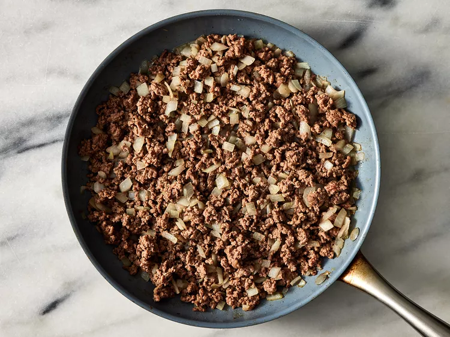
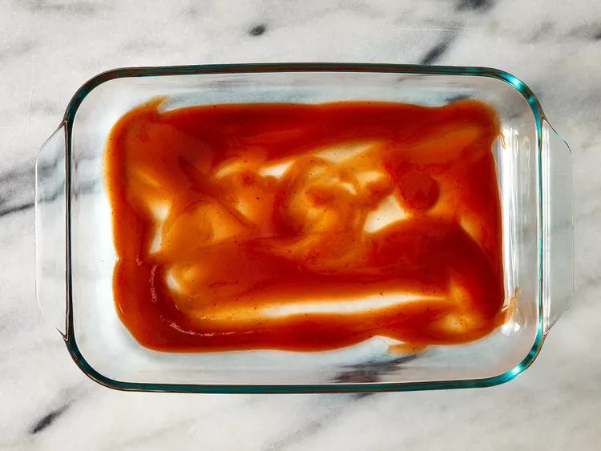
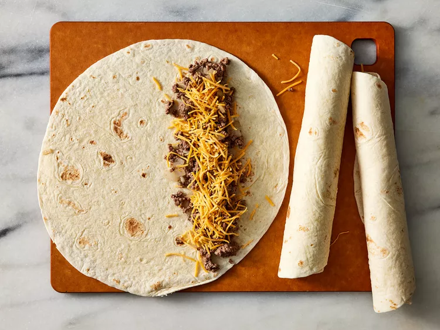
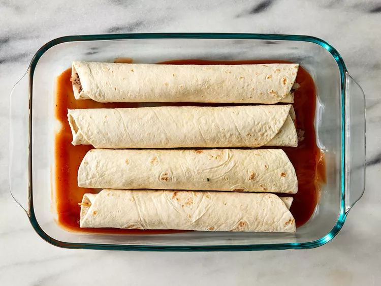
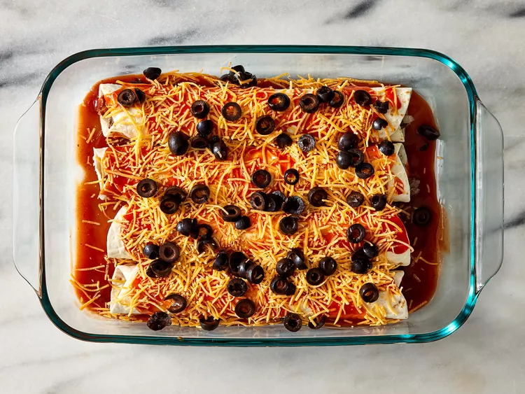
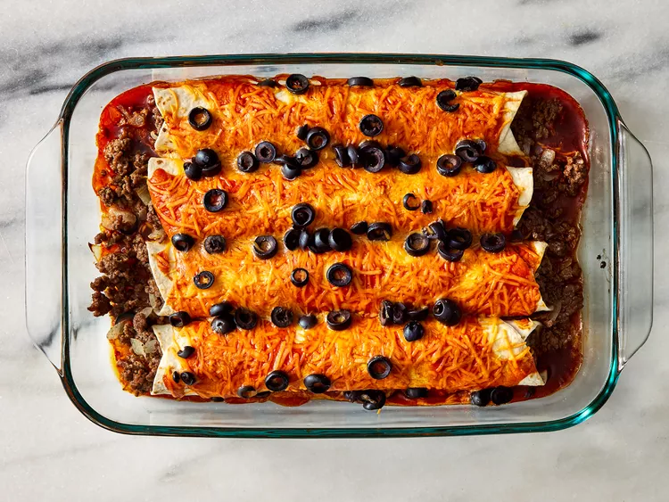
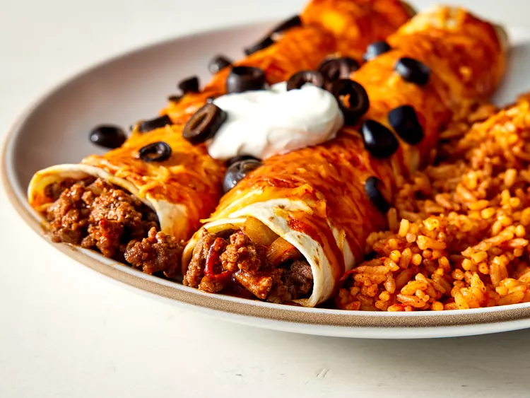

# Beef Enchiladas with Black Beans

A simple, quick, easy beef enchiladas recipe. Ground beef and onion are wrapped in flour tortillas, topped with
Cheddar cheese and black beans (substituted for olives). This is also great with leftover chicken, shredded beef, or
turkey. Serve with a green salad or beans and rice.

## Metadata

- **Author**: Becky
- **Source**: [AllRecipes - Beef Enchiladas with Flour Tortillas](https://www.allrecipes.com/recipe/26589/beef-enchiladas-ii/)
- **Cuisine**: Mexican
- **Category**: Main Course
- **Difficulty**: Easy
- **Servings**: 10
- **Prep Time**: PT20M (20 minutes)
- **Cook Time**: PT30M (30 minutes)
- **Total Time**: PT50M (50 minutes)
- **Status**: want-to-try
- **Tags**: mexican, weeknight, comfort-food, ground-beef
- **Date Added**: 2026-01-25
- **Date Modified**: 2026-01-25

## Ingredients

- 1 pound lean ground beef
- 1 small onion, chopped
- 1 (1.5 ounce) package dry enchilada sauce mix
- 10 (10 inch) flour tortillas
- 2 cups shredded Cheddar cheese, divided
- 1 (15 ounce) can black beans, drained and rinsed (substituted for black olives)

## Instructions

1. **Preheat oven**: Preheat the oven to 350 degrees F (175 degrees C).

2. **Cook beef and onion**: Cook ground beef and onion in a medium skillet over medium-high heat until beef is evenly
   browned and onion is tender.

   

3. **Prepare sauce**: Prepare enchilada sauce according to package directions. Pour 1/4 cup of the sauce into the
   bottom of a 9x13-inch baking dish.

   

4. **Fill tortillas**: Place an equal portion of the ground beef mixture and about 1 ounce of Cheddar cheese on each
   flour tortilla, reserving at least 1/2 cup of cheese. Then tightly roll the tortillas.

   

5. **Arrange in dish**: Place rolled tortillas seam side down in the baking dish.

   

6. **Top and bake**: Pour remaining sauce over the top of the enchiladas and sprinkle with remaining cheese and black beans.

   

7. **Bake**: Bake in the preheated oven until the sauce is bubbly and cheese is thoroughly melted, about 20 minutes.

   

8. **Serve**: Garnish to taste and serve with your favorite side. Enjoy!

   

## Notes

- **Olive substitution**: Black beans substituted for black olives as both Rebecca and Franz don't like olives.
- Original recipe uses 1 (2.25 ounce) can sliced black olives - replaced with 1 (15 ounce) can black beans, drained
  and rinsed.
- Can also be made with leftover chicken, shredded beef, or turkey instead of ground beef.
- Great served with a green salad or beans and rice.

## Variations

- Use taco seasoning mix in the ground beef mixture for extra flavor
- Substitute canned enchilada sauce for the dry mix if preferred
- Add diced green chilies to the beef mixture
- Top with sour cream, avocado, or fresh cilantro before serving
